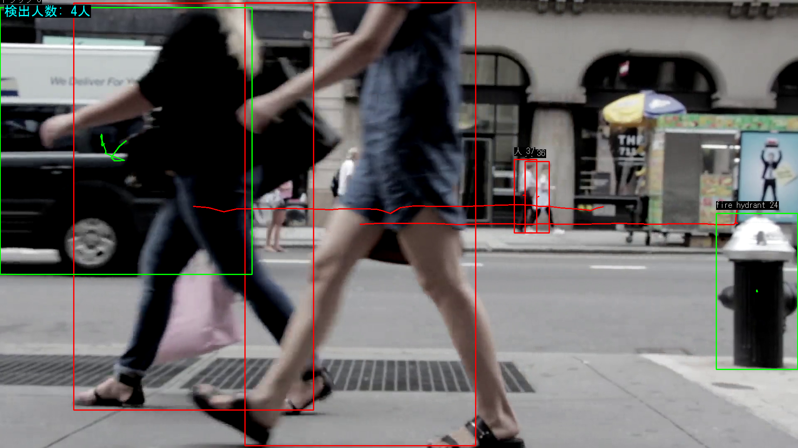
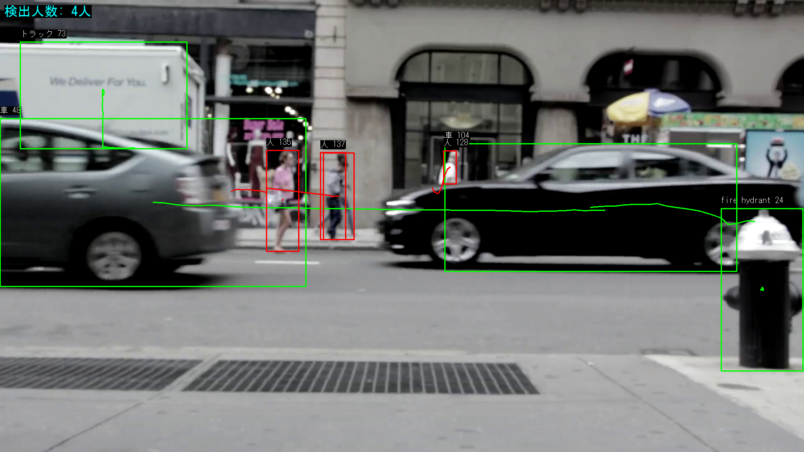
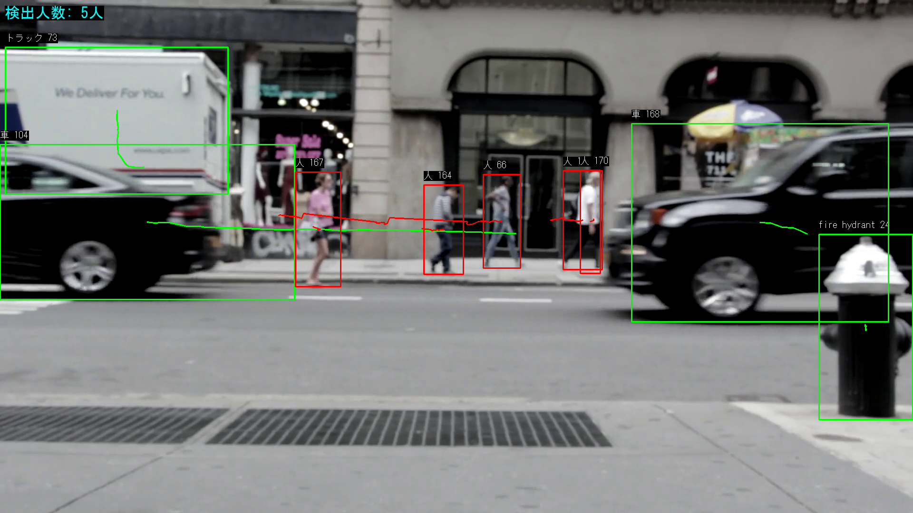

# YOLO11 Multi-Object Tracking デモ

YOLOv11を使用したリアルタイム物体検出・追跡システムです。

## ① プログラムの変更点（実装した機能）

### 1. マルチオブジェクトトラッキング
- **ByteTrack** アルゴリズムを使用して、検出した物体に固有IDを割り当て
- 映像中の同一オブジェクトを追跡し、IDが維持される

### 2. 軌跡描画機能
- 追跡オブジェクトの移動経路を画面上に線で可視化
- 過去30フレーム分の座標履歴を保持

### 3. 日本語ラベル表示
- OpenCVのputTextでは表示できない日本語を、**Pillow**を使用して描画
- 「人」「車」などの日本語クラス名を表示

### 4. リアルタイム人数カウント
- 画面左上に「検出人数: X人」をリアルタイム表示

---

## ② プログラムソースコード

### ディレクトリ構成
```
yolo_project/
├── src/
│   └── tracking_app.py   # メインの追跡アプリケーション
├── training/
│   ├── train.py          # カスタム学習スクリプト
│   └── dataset.yaml      # データセット設定
├── results/              # 結果スクリーンショット
└── README.md
```

### メインコード: `src/tracking_app.py`

```python
from ultralytics import YOLO
import cv2
import numpy as np
from PIL import Image, ImageDraw, ImageFont
from collections import defaultdict

# 設定
SOURCE = "video.mp4"  # 入力動画 (0でカメラ)
model_name = 'yolo11n.pt'

# 日本語クラス名
CLASS_NAMES_JA = {
    "person": "人", "car": "車", "dog": "犬", ...
}

# 軌跡保存用
track_history = defaultdict(lambda: [])

# 日本語描画関数
def put_japanese_text(img, text, position, font, ...):
    img_pil = Image.fromarray(cv2.cvtColor(img, cv2.COLOR_BGR2RGB))
    draw = ImageDraw.Draw(img_pil)
    draw.text(position, text, font=font, fill=text_color)
    return cv2.cvtColor(np.array(img_pil), cv2.COLOR_RGB2BGR)

# YOLO11モデル読み込み
model = YOLO(model_name)

# メインループ
while True:
    ret, frame = cap.read()
    if not ret: break
    
    # 追跡実行 (ByteTrack)
    results = model.track(frame, persist=True, tracker="bytetrack.yaml")
    
    # 各検出オブジェクトを処理
    for box_id, box_xyxy, cls_id in zip(track_ids, boxes_xyxy, classes):
        # 軌跡を記録・描画
        track_history[box_id].append((center_x, center_y))
        cv2.polylines(frame, [points], ...)
        
        # 日本語ラベル描画
        put_japanese_text(frame, "人 1", ...)
    
    # 人数カウント表示
    put_japanese_text(frame, f"検出人数: {count}人", ...)
```

---

## ③ 実行結果

### スクリーンショット

#### マルチオブジェクトトラッキング + 軌跡描画


#### 日本語ラベル + 人数カウント表示


#### 複数オブジェクトの追跡


### 実行方法

```bash
# 依存パッケージのインストール
pip install ultralytics opencv-python pillow

# 実行
python src/tracking_app.py
```

---

## 使用技術

- **YOLO11** (Ultralytics) - 物体検出モデル
- **ByteTrack** - マルチオブジェクトトラッキング
- **OpenCV** - 動画処理
- **Pillow** - 日本語テキスト描画
